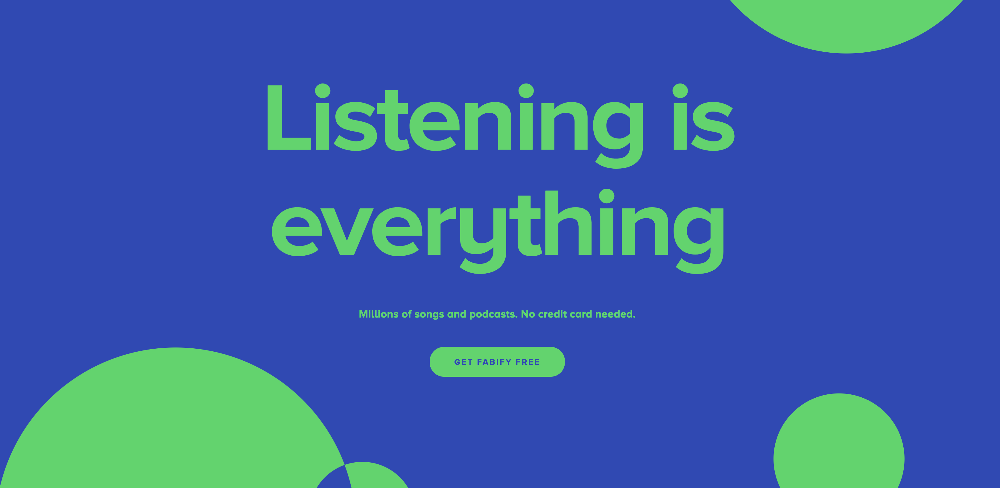

[<div style="text-align: center"></div>](https://fabify.herokuapp.com/#/)

<h3 style="text-align: center">Listening is Everything</h3>

# Table of Contents
1. Introduction
2. Features
3. Recent Updates
4. Technology
5. A closer look
    * Video Views
    * Smart Errors
6. Final Notes

## Highlights 

Fabify is a clone of Spotify that exclusively features currated content created by artists that identify as LBGTQIA+. Aptly named Fabify as the music housed within the application is Fabulous.

## Login / Sign Up

Fabify features user auth that only allows members that have signed up for Fabify to step within the walls for this exlcuive content. As well as the ability to sign in and out of the app. If you try to log in with incorrect credentials or sign up with a duplicate email address, you will receive an error message. 

## Create Playlists

Once logged in, users have the ability to create, view, update and delete their own personal selection of playlists. Users may add and remove songs, title their playlists, as well as provide a description of their playlist for other users who may wish to follow their playlist of currated music. 

## Continous Play 
This currated audio player allows users to move within the walls of the application and load new components of the app whilst continually listening to their favorite music. My cutom toggle play pause method allows users to pause and play their music at the click of a button.


```javascript
  togglePlayPause(id, name, photo, artist) {
    const audioEle = document.getElementById(`audio-element--${id}`);
    if (this.state.selectedSong === id) {
      this.setState({ playingSong: !this.state.playingSong });
    } else {
      // this where we set a new song
      this.setState({
        selectedSong: id,
        playingSong: false,
        name: name,
        photo: photo,
        artist: artist,
      });
    }

    if (this.state.playingSong) {
      audioEle.pause();
    } else {
      audioEle.play();
    }
  }
```

# Technologies Used
* React.js
* Redux
* Javascript
* Ruby on Rails
* SCSS / CSS
* PostgreSQL
* Heroku
* AWS S3
